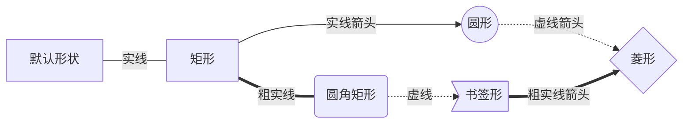
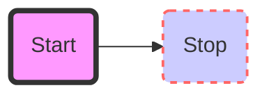

一个使用类似Markdown语法来绘制适量图表的技术[mermaid](https://github.com/knsv/mermaid)在Github上出现了并迅速被各界大佬关注分享。Markdown在Github的推广下得到广泛使用，它改变了技术人员的文档书写方式。如果mermaid也能够得到广泛支持和普及的话，文档表现形式将更加丰富和先进，希望该项目能持续稳定发展。

<!-- more -->

### 图表定义

使用`graph <布局方式>`的方式声明图表，可用图形布局方式有
* `TB` 或 `TD` - 从上到下
* `BT` - 从下到上
* `RL` - 从右到左
* `LR` - 从左到右

#### 节点

Mermaid中的节点都有一个id和一个标签，id用于代表节点，标签表示节点的显示文字。如果没有设置标签则使用id作为节点的标签，节点的标签可以被多次设置，显示为最后一次设置的内容。

Mermaid中使用下列几种方式来连接连个节点
* `---` 实线
* `-->` 实线箭头
* `-.-` 虚线
* `-.->` 虚线箭头
* `===` 粗实线
* `===>` 粗实线箭头

同时允许我们在关系线生贴标签文字

示例


```@mermaid
graph LR
    默认形状 ---|实线| A
    A[矩形] -- 实线箭头 --> B((圆形))
    A ===|粗实线| C(圆角矩形)
    B -.虚线箭头.-> D{菱形}
    C -.虚线.-> E>书签形]
    E ==粗实线箭头==> D
```

#### 子图表
子图表用于给节点归组，不会创建新的id作用域
```@mermaid
graph TB
  subgraph one
    a1-->a2
    end
  subgraph two
    b1-->b2
    end
  subgraph three
    c1-->c2
    end
  c1-->a2[A2]
```

#### 节点样式

mermaid允许自定义节点样式，诸如背景色，描边等。



```@mermaid
graph LR
    id1(Start)-->id2(Stop)
    style id1 fill:#f9f,stroke:#333,stroke-width:4px;
    style id2 fill:#ccf,stroke:#f66,stroke-width:2px,stroke-dasharray: 5, 5;
```

此外mermaid还能定义样式变量，然后再将其应用到多个节点上。

```@mermaid
graph LR
    id1(Start)-->id2(Stop)
    classDef className "fill:#f9f,stroke:#333,stroke-width:4px;"
    class id1 className;
```
#### FontAwesome符号支持
Mermaid支持在标签中使用[FontAwesome](http://fontawesome.io)提供的的图标字体。

```@mermaid
graph TD
    B["fa:fa-twitter for peace"]
    B-->C[fa:fa-ban forbidden]
    B-->D(fa:fa-spinner);
    B-->E(A fa:fa-camera-retro perhaps?);
```
### 更多图表
上述语法已经能够绘制出日常所需的流程图表了，除此之外Mermaid还对流程顺序控制、时序控制图表有特殊支持。更多使用姿势请查阅[Mermaid官方文档](http://knsv.github.io/mermaid/#styling34)。
